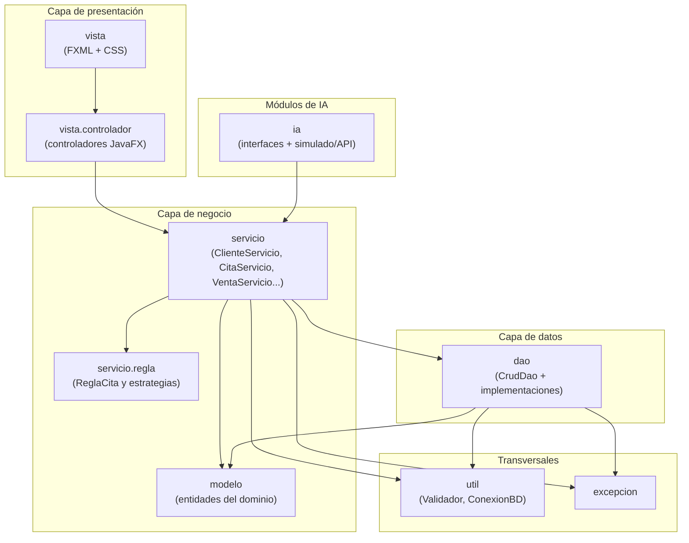
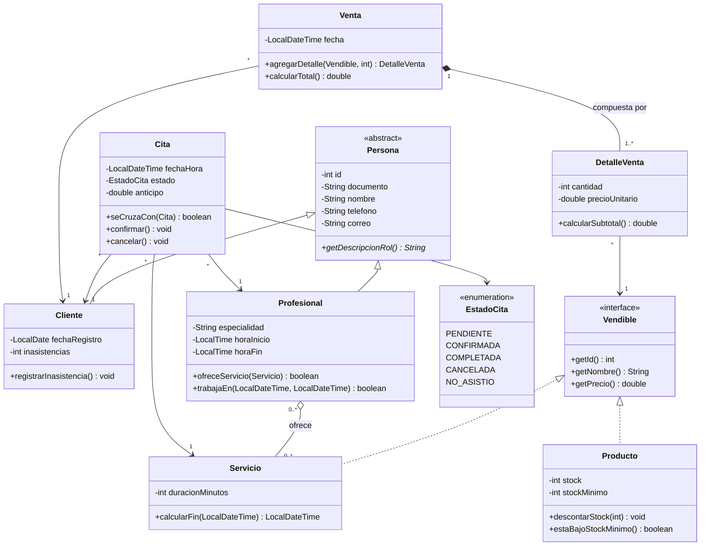
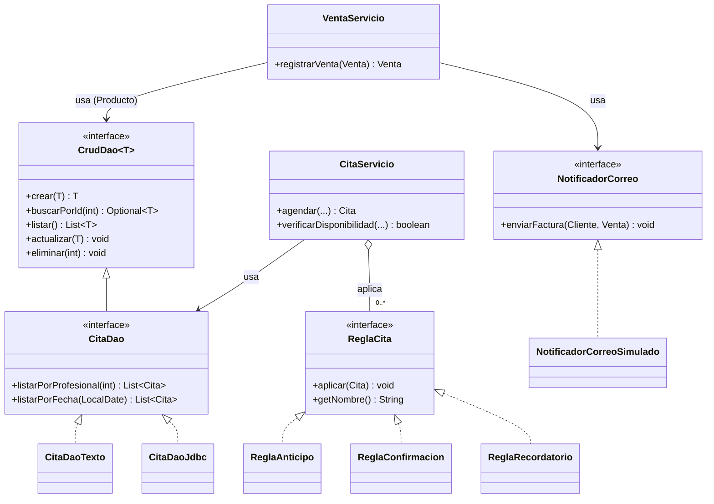

# Fase 2 — Diseño de clases y arquitectura · Maison Glow

> Documento base de la **Entrega 1**. Sigue el orden de la rúbrica de la Fase 2 y deja listo lo que la Fase 3 implementa
> (clases básicas, constructores, getters/setters, herencia, polimorfismo, interfaces, colecciones).
> Contexto y decisiones: [`../../PLANIFICACION.md`](../../PLANIFICACION.md) · [`../adr/`](../adr/README.md)

> **Nomenclatura en el código.** Los identificadores, el Javadoc y los commits están en inglés; los mensajes al usuario, en español.
> Este documento usa los nombres del dominio en español; en el código se corresponden así:
>
> | Diseño (español) | Código (inglés) |
> |---|---|
> | `Persona`, `Cliente`, `Profesional` | `Person`, `Customer`, `Professional` |
> | `Producto`, `Servicio`, `Vendible` | `Product`, `BeautyService`, `Sellable` |
> | `Cita`, `EstadoCita`, `ReglaCita` | `Appointment`, `AppointmentStatus`, `AppointmentRule` |
> | `Venta`, `DetalleVenta` | `Sale`, `SaleLine` |
> | `CitaServicio`, `VentaServicio`, `CatalogoServicios` | `AppointmentService`, `SaleService`, `BeautyServiceCatalog` |
> | `NotificadorCorreo`, `Validador` | `EmailNotifier`, `Validator` |
> | Paquetes `modelo`, `servicio`, `servicio.regla`, `vista`, `excepcion`, `ia` | `model`, `service`, `service.rule`, `ui`, `exception`, `ai` |
> | Métodos (`descontarStock`, `calcularTotal`, `agendar`) | `deductStock`, `calculateTotal`, `book` |

**Contenido**
1. [Arquitectura y diagrama de paquetes](#1-arquitectura-y-diagrama-de-paquetes)
2. [Identificación de clases](#2-identificación-de-clases)
3. [Definición de clases (atributos, métodos, responsabilidades)](#3-definición-de-clases)
4. [Diagramas de clases y relaciones](#4-diagramas-de-clases-y-relaciones)
5. [Herencia, interfaces y clases abstractas](#5-herencia-interfaces-y-clases-abstractas)
6. [Diseño preliminar de la interfaz gráfica](#6-diseño-preliminar-de-la-interfaz-gráfica)
7. [Patrones GRASP](#7-patrones-grasp)
8. [Principios SOLID](#8-principios-solid)
9. [Guía de implementación para la Fase 3](#9-guía-de-implementación-para-la-fase-3)

> **Convenciones de este documento**
> - Paquete raíz: `com.maisonglow`. Dinero como `double` (simplicidad del curso); fechas con `java.time`.
> - Los `id` son `int`; los asigna el DAO al crear (0 = aún no guardado). Se diseñaron para coincidir con las tablas de `sql/schema.sql`.
> - Las clases de negocio se nombran `XxxServicio`. **Única excepción:** la lógica de la entidad `Servicio` se llama `CatalogoServicios` para evitar el nombre `ServicioServicio`.

---

## 1. Arquitectura y diagrama de paquetes

Arquitectura en **3 capas** ([ADR-0001](../adr/0001-arquitectura-en-tres-capas.md)). Regla: `vista → servicio → dao`; la IA se conecta solo a través de interfaces ([ADR-0005](../adr/0005-ia-desacoplada-por-interfaces.md)).



| Capa | Paquetes | Responsabilidad |
|---|---|---|
| Presentación | `vista`, `vista.controlador` | Mostrar datos, capturar eventos y presentar errores. No contiene reglas de negocio ni SQL |
| Negocio | `servicio`, `servicio.regla`, `modelo` | Reglas, validaciones, coordinación de operaciones; entidades con su comportamiento propio |
| Datos | `dao` | Persistir y recuperar entidades. En la Entrega 1: archivos de texto; luego JDBC ([ADR-0012](../adr/0012-persistencia-en-archivos-de-texto.md)) |
| IA | `ia` | Probador virtual y asistente, detrás de interfaces; las herramientas del asistente llaman a `servicio` |
| Transversal | `util`, `excepcion` | Validaciones, conexión, jerarquía de excepciones ([ADR-0008](../adr/0008-manejo-de-excepciones.md)) |

---

## 2. Identificación de clases

| # | Nombre de la clase | Tipo | Descripción y rol en el sistema |
|---|---|---|---|
| 1 | `Persona` | Abstracta | Datos comunes de toda persona (documento, nombre, teléfono, correo). Raíz de la jerarquía |
| 2 | `Cliente` | Concreta | Persona que compra y agenda citas; correo para la factura |
| 3 | `Profesional` | Concreta | Persona que presta servicios; define su horario y los servicios que ofrece |
| 4 | `Vendible` | Interfaz | Contrato de todo lo que puede venderse (nombre y precio). Permite ventas polimórficas |
| 5 | `Producto` | Concreta | Artículo físico con stock y stock mínimo |
| 6 | `Servicio` | Concreta | Servicio de belleza con precio y duración |
| 7 | `Cita` | Concreta | Reserva de un servicio con un profesional en una fecha/hora; conoce su estado |
| 8 | `Venta` | Concreta | Transacción comercial de un cliente; agrupa detalles y calcula el total |
| 9 | `DetalleVenta` | Concreta | Línea de una venta: un `Vendible`, cantidad y precio al momento de vender |
| 10 | `EstadoCita` | Enumeración | Estados del ciclo de vida de una cita |
| 11 | `CrudDao<T>` | Interfaz | Contrato CRUD de la capa de datos |
| 12 | `ClienteDaoTexto`, `ProductoDaoTexto`, ... | Concreta | Implementaciones en archivo de texto de los DAO (Entrega 1), sobre la base `TextFileDao<T>` |
| 13 | `ReglaCita` | Interfaz | Contrato de una regla de negocio de citas |
| 14 | `ReglaAnticipo`, `ReglaConfirmacion`, `ReglaRecordatorio` | Concretas | Reglas concretas de RF-26 |
| 15 | `ClienteServicio`, `ProfesionalServicio`, `CatalogoServicios`, `ProductoServicio` | Concretas | Lógica de negocio de cada módulo (CRUD con validación) |
| 16 | `CitaServicio` | Concreta | Agendamiento, disponibilidad, conflicto de horario y aplicación de reglas |
| 17 | `VentaServicio` | Concreta | Registro de ventas, descuento de stock y envío de factura |
| 18 | `EstadisticaServicio` | Concreta | Estadísticas de cliente y administrador; baja rotación |
| 19 | `NotificadorCorreo` / `NotificadorCorreoSimulado` | Interfaz / Concreta | Envío de facturas por correo, desacoplado del proveedor |
| 20 | `Validador` | Concreta (utilidad) | Validaciones reutilizables de datos de entrada |
| 21 | `ValidacionException`, `ReglaNegocioException`, `AccesoDatosException` | Concretas | Jerarquía de excepciones del sistema |

> Las clases del paquete `ia` (`ProbadorVirtual`, `AsistenteInteligente`, `HerramientaAsistente`, `RegistroHerramientas`) se diseñan en la Entrega 2 ([ADR-0005](../adr/0005-ia-desacoplada-por-interfaces.md), [ADR-0006](../adr/0006-herramientas-del-asistente-tipo-mcp.md)).

---

## 3. Definición de clases

### 3.1 Modelo de dominio

#### Clase: `Persona`
**Tipo:** Abstracta · **Responsabilidad principal:** Concentrar los datos y comportamiento comunes de las personas del negocio para evitar duplicarlos en `Cliente` y `Profesional`.

| Atributo | Tipo de dato | Descripción |
|---|---|---|
| `id` | `int` | Identificador (asignado al guardar) |
| `documento` | `String` | Cédula o documento único |
| `nombre` | `String` | Nombre completo |
| `telefono` | `String` | Teléfono de contacto |
| `correo` | `String` | Correo electrónico |

| Método | Tipo de retorno | Descripción |
|---|---|---|
| `Persona(int, String, String, String, String)` | — | Constructor completo (protegido) |
| `getId()`, `getDocumento()`, `getNombre()`, `getTelefono()`, `getCorreo()` | tipo del atributo | Getters |
| `setId(int)`, `setNombre(String)`, `setTelefono(String)`, `setCorreo(String)` | `void` | Setters (el documento no cambia) |
| `getDescripcionRol()` | `String` | **Abstracto**: rol de la persona ("Cliente", "Profesional") |
| `toString()` / `equals(Object)` / `hashCode()` | `String` / `boolean` / `int` | Sobrescritos; igualdad por `documento` |

#### Clase: `Cliente`
**Tipo:** Concreta (extiende `Persona`) · **Responsabilidad principal:** Representar al cliente del negocio, con su fecha de registro, para asociarlo a citas y compras.

| Atributo | Tipo de dato | Descripción |
|---|---|---|
| `fechaRegistro` | `LocalDate` | Día en que se registró |
| `inasistencias` | `int` | Citas a las que no asistió (insumo para penalización) |

| Método | Tipo de retorno | Descripción |
|---|---|---|
| `Cliente(...)` | — | Constructor que llama a `super(...)` |
| `getFechaRegistro()`, `getInasistencias()` | tipo del atributo | Getters |
| `registrarInasistencia()` | `void` | Incrementa `inasistencias` |
| `getDescripcionRol()` | `String` | Sobrescrito: devuelve `"Cliente"` |

#### Clase: `Profesional`
**Tipo:** Concreta (extiende `Persona`) · **Responsabilidad principal:** Representar al especialista, los servicios que presta y su horario laboral, para decidir si puede atender una cita.

| Atributo | Tipo de dato | Descripción |
|---|---|---|
| `especialidad` | `String` | Área principal (peluquería, maquillaje...) |
| `horaInicio` | `LocalTime` | Inicio de su jornada |
| `horaFin` | `LocalTime` | Fin de su jornada |
| `servicios` | `List<Servicio>` | Servicios que ofrece (`ArrayList`) |

| Método | Tipo de retorno | Descripción |
|---|---|---|
| `Profesional(...)` | — | Constructor; inicializa `servicios` vacío |
| `agregarServicio(Servicio)` / `quitarServicio(Servicio)` | `void` | Mantiene la lista (sin duplicados) |
| `ofreceServicio(Servicio)` | `boolean` | ¿Presta este servicio? |
| `trabajaEn(LocalDateTime inicio, LocalDateTime fin)` | `boolean` | ¿El intervalo cae dentro de su jornada? |
| `getServicios()` | `List<Servicio>` | Copia inmodificable de la lista |
| `getDescripcionRol()` | `String` | Sobrescrito: devuelve `"Profesional"` |

#### Interfaz: `Vendible`
**Tipo:** Interfaz · **Responsabilidad principal:** Definir lo mínimo que cualquier ítem vendible debe exponer, para que `Venta` los trate de forma uniforme.

| Método | Tipo de retorno | Descripción |
|---|---|---|
| `getId()` | `int` | Identificador del ítem |
| `getNombre()` | `String` | Nombre mostrado en la factura |
| `getPrecio()` | `double` | Precio unitario actual |

#### Clase: `Producto`
**Tipo:** Concreta (implementa `Vendible`) · **Responsabilidad principal:** Modelar un artículo y proteger la coherencia de su inventario.

| Atributo | Tipo de dato | Descripción |
|---|---|---|
| `id` | `int` | Identificador |
| `nombre` | `String` | Nombre comercial |
| `categoria` | `String` | Categoría (cabello, piel, uñas...) |
| `precio` | `double` | Precio de venta |
| `stock` | `int` | Unidades disponibles |
| `stockMinimo` | `int` | Umbral de alerta de inventario bajo |
| `activo` | `boolean` | Si está disponible para venta |

| Método | Tipo de retorno | Descripción |
|---|---|---|
| `Producto(...)` | — | Constructor completo |
| getters / setters | — | Encapsulamiento de todos los atributos |
| `hayStock(int cantidad)` | `boolean` | ¿Alcanza el inventario? |
| `descontarStock(int cantidad)` | `void` | Resta unidades; lanza `ReglaNegocioException` si no alcanzan |
| `aumentarStock(int cantidad)` | `void` | Suma unidades (reposición) |
| `estaBajoStockMinimo()` | `boolean` | `stock <= stockMinimo` (RF-19) |
| `toString()` / `equals` / `hashCode` | — | Sobrescritos; igualdad por `id` |

#### Clase: `Servicio`
**Tipo:** Concreta (implementa `Vendible`) · **Responsabilidad principal:** Describir un servicio de belleza con su precio y duración, que determina cuánto tiempo bloquea la agenda.

| Atributo | Tipo de dato | Descripción |
|---|---|---|
| `id` | `int` | Identificador |
| `nombre` | `String` | Nombre del servicio |
| `descripcion` | `String` | Detalle |
| `precio` | `double` | Precio |
| `duracionMinutos` | `int` | Duración (RF-07) |
| `activo` | `boolean` | Si se ofrece actualmente |

| Método | Tipo de retorno | Descripción |
|---|---|---|
| `Servicio(...)` | — | Constructor completo |
| getters / setters | — | Encapsulamiento |
| `calcularFin(LocalDateTime inicio)` | `LocalDateTime` | `inicio + duracionMinutos` |
| `toString()` / `equals` / `hashCode` | — | Sobrescritos; igualdad por `id` |

#### Clase: `Cita`
**Tipo:** Concreta · **Responsabilidad principal:** Representar una reserva y gobernar sus cambios de estado y su cruce con otras citas.

| Atributo | Tipo de dato | Descripción |
|---|---|---|
| `id` | `int` | Identificador |
| `cliente` | `Cliente` | Quien reserva |
| `profesional` | `Profesional` | Quien atiende |
| `servicio` | `Servicio` | Servicio reservado |
| `fechaHora` | `LocalDateTime` | Inicio de la cita |
| `estado` | `EstadoCita` | `PENDIENTE`, `CONFIRMADA`, `COMPLETADA`, `CANCELADA`, `NO_ASISTIO` |
| `anticipo` | `double` | Depósito pagado |
| `recordatorio` | `LocalDateTime` | Momento programado del recordatorio |

| Método | Tipo de retorno | Descripción |
|---|---|---|
| `Cita(...)` | — | Constructor; estado inicial `PENDIENTE` |
| getters / setters | — | Encapsulamiento |
| `getFechaHoraFin()` | `LocalDateTime` | `servicio.calcularFin(fechaHora)` |
| `seCruzaCon(Cita otra)` | `boolean` | Intervalos solapados (inicio < fin ajeno y fin > inicio ajeno) |
| `confirmar()` / `cancelar()` / `completar()` | `void` | Transiciones de estado; `ReglaNegocioException` si la transición es inválida |
| `marcarNoAsistio()` | `void` | Cambia a `NO_ASISTIO` e incrementa inasistencias del cliente |
| `estaActiva()` | `boolean` | `PENDIENTE` o `CONFIRMADA` (las únicas que bloquean la agenda) |

#### Clase: `Venta`
**Tipo:** Concreta · **Responsabilidad principal:** Agrupar los detalles de una venta y calcular su total.

| Atributo | Tipo de dato | Descripción |
|---|---|---|
| `id` | `int` | Identificador |
| `cliente` | `Cliente` | Comprador |
| `fecha` | `LocalDateTime` | Momento de la venta |
| `detalles` | `List<DetalleVenta>` | Líneas de la venta (`ArrayList`) |

| Método | Tipo de retorno | Descripción |
|---|---|---|
| `Venta(Cliente)` | — | Constructor; fecha = ahora, detalles vacíos |
| `agregarDetalle(Vendible, int cantidad)` | `DetalleVenta` | **Crea** el detalle (Creator) y lo añade; si el ítem ya está, suma cantidad |
| `calcularTotal()` | `double` | Suma de subtotales |
| `getDetalles()` | `List<DetalleVenta>` | Vista inmodificable |
| `getCliente()`, `getFecha()`, `getId()` / `setId(int)` | — | Acceso |

#### Clase: `DetalleVenta`
**Tipo:** Concreta · **Responsabilidad principal:** Registrar una línea de la venta conservando el precio del momento (el precio del catálogo puede cambiar después).

| Atributo | Tipo de dato | Descripción |
|---|---|---|
| `item` | `Vendible` | Producto o servicio vendido (polimorfismo) |
| `cantidad` | `int` | Unidades |
| `precioUnitario` | `double` | Precio al vender |

| Método | Tipo de retorno | Descripción |
|---|---|---|
| `DetalleVenta(Vendible, int)` | — | Constructor; copia `item.getPrecio()` |
| `calcularSubtotal()` | `double` | `cantidad × precioUnitario` |
| `esProducto()` | `boolean` | `item instanceof Producto` (para descontar stock) |
| getters / `aumentarCantidad(int)` | — | Acceso y ajuste |

### 3.2 Capa de datos y reglas

#### Interfaz: `CrudDao<T>`
**Tipo:** Interfaz · **Responsabilidad principal:** Definir el contrato de persistencia que usan los servicios, sin revelar si hay archivos de texto, SQLite u otra tecnología.

| Método | Tipo de retorno | Descripción |
|---|---|---|
| `crear(T)` | `T` | Guarda y devuelve la entidad con `id` asignado |
| `buscarPorId(int)` | `Optional<T>` | Busca una entidad |
| `listar()` | `List<T>` | Todas las entidades |
| `actualizar(T)` | `void` | Modifica una existente |
| `eliminar(int)` | `void` | Elimina por id |

Todos lanzan `AccesoDatosException`. Interfaces específicas (`CitaDao extends CrudDao<Cita>`) añaden consultas propias, p. ej. `listarPorProfesional(int)` y `listarPorFecha(LocalDate)`; `VentaDao` añade `listarPorRango(...)`.
**Implementaciones:** `XxxDaoTexto` (Entrega 1, archivo `.txt` + `Map` en memoria) y `XxxDaoJdbc` (Entrega 2).

#### Interfaz: `ReglaCita`
**Tipo:** Interfaz · **Responsabilidad principal:** Permitir añadir reglas de negocio de citas sin modificar `CitaServicio` ([ADR-0007](../adr/0007-reglas-de-cita-como-estrategias.md)).

| Método | Tipo de retorno | Descripción |
|---|---|---|
| `aplicar(Cita cita)` | `void` | Valida o completa la cita; lanza `ReglaNegocioException` si incumple |
| `getNombre()` | `String` | Nombre para mensajes |

| Implementación | Qué hace |
|---|---|
| `ReglaAnticipo` | Exige un anticipo mínimo (`porcentaje` del precio del servicio, configurable) |
| `ReglaConfirmacion` | Exige antelación mínima (`horasMinimas`) para agendar y deja la cita `PENDIENTE` hasta confirmar |
| `ReglaRecordatorio` | Calcula `cita.recordatorio` (`horasAntes` antes del inicio) |

### 3.3 Capa de negocio

#### Clase: `CitaServicio`
**Tipo:** Concreta · **Responsabilidad principal:** Coordinar el agendamiento de citas garantizando que el profesional esté disponible y que se cumplan las reglas.

| Atributo | Tipo de dato | Descripción |
|---|---|---|
| `citaDao` | `CitaDao` | Acceso a datos (inyectado) |
| `reglas` | `List<ReglaCita>` | Reglas configurables (inyectadas) |

| Método | Tipo de retorno | Descripción |
|---|---|---|
| `CitaServicio(CitaDao, List<ReglaCita>)` | — | Constructor con inyección de dependencias |
| `agendar(Cliente, Profesional, Servicio, LocalDateTime, double anticipo)` | `Cita` | Valida datos, que el profesional ofrezca el servicio y trabaje en ese horario, **sin conflicto** (RF-11/12), aplica reglas y guarda |
| `verificarDisponibilidad(Profesional, LocalDateTime inicio, LocalDateTime fin)` | `boolean` | Sin cruce con citas activas (reutilizado por el asistente) |
| `confirmar(int)` / `cancelar(int)` / `completar(int)` | `void` | Cambia el estado y persiste |
| `reprogramar(int, LocalDateTime)` | `Cita` | Modifica fecha (RF-13) revalidando disponibilidad |
| `listarPorFecha(LocalDate)` | `List<Cita>` | Agenda del día |

#### Clase: `VentaServicio`
**Tipo:** Concreta · **Responsabilidad principal:** Registrar ventas completas manteniendo coherente el inventario y notificando la factura.

| Atributo | Tipo de dato | Descripción |
|---|---|---|
| `ventaDao` | `VentaDao` | Persistencia de ventas |
| `productoDao` | `CrudDao<Producto>` | Para actualizar stock |
| `notificador` | `NotificadorCorreo` | Envío de factura |

| Método | Tipo de retorno | Descripción |
|---|---|---|
| `VentaServicio(VentaDao, CrudDao<Producto>, NotificadorCorreo)` | — | Constructor con inyección |
| `registrarVenta(Venta)` | `Venta` | Verifica que haya detalles y stock suficiente, descuenta stock de los productos, guarda y envía la factura (un fallo de correo no anula la venta) |
| `listarPorCliente(int)` | `List<Venta>` | Historial de compras |

#### Otras clases de negocio (resumen)

| Clase | Responsabilidad | Métodos principales |
|---|---|---|
| `ClienteServicio` | CRUD con validación de clientes (documento único, correo válido) | `registrar`, `actualizar`, `buscarPorId`, `buscarPorNombre`, `listar`, `eliminar` |
| `ProfesionalServicio` | CRUD de profesionales y vínculo con servicios | `registrar`, `asociarServicio(idProf, idServ)`, `listarPorServicio(idServ)` |
| `CatalogoServicios` | CRUD de servicios (precio > 0, duración > 0) | `registrar`, `actualizar`, `activar/desactivar`, `listar` |
| `ProductoServicio` | CRUD de productos y control de existencias | `registrar`, `actualizar`, `ajustarStock(id, delta)`, `listarStockBajo()` |
| `EstadisticaServicio` | Estadísticas (RF-18, 28–31) | `estadisticasCliente(id)`, `productosMasVendidos(n, desde, hasta)`, `productosBajaRotacion(n, desde, hasta)`, `serviciosMasSolicitados(n)` , `clientesFrecuentes(n)` — devuelven `Map<String,Integer>` (HashMap) |
| `NotificadorCorreo` | Contrato de envío de facturas | `enviarFactura(Cliente, Venta)` |
| `Validador` | Validaciones estáticas reutilizables | `requerirTexto`, `requerirCorreo`, `requerirPositivo`, `requerirTelefono` |

---

## 4. Diagramas de clases y relaciones

### 4.1 Dominio



### 4.2 Servicios, reglas y acceso a datos



### 4.3 Tabla de relaciones

| Relación | Tipo | Justificación |
|---|---|---|
| `Cliente`, `Profesional` → `Persona` | **Herencia** | Comparten datos y comportamiento; "es una" persona |
| `Producto`, `Servicio` → `Vendible` | **Realización** (interfaz) | No comparten estado, solo el contrato de ser vendibles |
| `Venta` ◆— `DetalleVenta` | **Composición** | Un detalle no existe sin su venta; se crea y se elimina con ella |
| `Profesional` ◇— `Servicio` | **Agregación** (N:M) | El servicio existe sin el profesional (tabla `profesional_servicio`) |
| `Cita` → `Cliente`/`Profesional`/`Servicio` | **Asociación** | La cita referencia entidades independientes |
| `DetalleVenta` → `Vendible` | **Asociación** polimórfica | Apunta a un `Producto` o a un `Servicio` indistintamente |
| `CitaServicio` ◇— `ReglaCita` | **Agregación** | Las reglas se inyectan y existen fuera del servicio |
| `XxxServicio` ⇢ `CrudDao`, `NotificadorCorreo` | **Dependencia** (inyectada) | Dependen de abstracciones, no de implementaciones |

---

## 5. Herencia, interfaces y clases abstractas

| Mecanismo | Dónde | Beneficio |
|---|---|---|
| **Clase abstracta** | `Persona` (método abstracto `getDescripcionRol()`) | Reutiliza atributos y getters; obliga a cada subclase a definir su rol |
| **Herencia** | `Persona` → `Cliente`, `Profesional` | Elimina duplicación |
| **Interfaz** | `Vendible`, `CrudDao<T>`, `ReglaCita`, `NotificadorCorreo` | Contratos desacoplados e intercambiables |
| **Polimorfismo por interfaz** | `Venta` recorre `List<DetalleVenta>` que apuntan a `Vendible`; `CitaServicio` itera `List<ReglaCita>` | Código sin `if (tipo == ...)` |
| **Polimorfismo por herencia** | `persona.getDescripcionRol()` | Cada subclase responde a su manera |
| **Métodos sobrescritos** | `toString()`, `equals()`, `hashCode()`, `getDescripcionRol()`, `getPrecio()` | Representación y comparación coherentes |
| **Colecciones** | `ArrayList` (`servicios`, `detalles`, resultados de `listar`), `HashMap` (caché de los DAO; estadísticas), `Optional` | Requisito de la Fase 3 |

---

## 6. Diseño preliminar de la interfaz gráfica

Tecnología: **JavaFX + FXML + CSS** ([ADR-0009](../adr/0009-ui-con-javafx.md)). Los mockups finales (Figma o draw.io) se guardan en `docs/fase2/mockups/` y se enlazan aquí. Responsable: Isabella, con apoyo de Nicoll.

| # | Pantalla | Componentes principales | Eventos → servicio | RF |
|---|---|---|---|---|
| M1 | Principal / navegación | Menú lateral, barra superior, panel de contenido | Navegar entre módulos | RF-20 |
| M2 | Clientes | Tabla, formulario, buscador | Guardar/Buscar → `ClienteServicio` | RF-01, 02 |
| M3 | Profesionales y servicios | Tablas, lista de servicios por profesional | Asociar → `ProfesionalServicio`, `CatalogoServicios` | RF-06 a 09 |
| M4 | Productos e inventario | Tabla con alerta de stock bajo, formulario | Guardar/Ajustar → `ProductoServicio` | RF-03 a 05, 19 |
| M5 | Agenda de citas | Selector de fecha, lista del día, formulario de cita | Agendar/Cancelar → `CitaServicio` | RF-10 a 13 |
| M6 | Nueva venta | Cliente, productos/servicios, carrito, total | Agregar/Cobrar → `VentaServicio` | RF-14 a 17 |
| M7 | Estadísticas | Filtros de fecha, tablas/gráficos, baja rotación | Consultar → `EstadisticaServicio` | RF-18, 28 a 31 |
| M8 | Probador virtual *(Entrega 2)* | Foto, selector de transformación, resultado | Generar → `ProbadorVirtual` | RF-21 |
| M9 | Asistente *(Entrega 2)* | Chat, confirmación de acciones | Enviar → `AsistenteInteligente` | RF-22, 23 |

Wireframes iniciales de referencia:

```
M1 Principal                           M5 Agenda de citas
┌────────────────────────────────┐     ┌────────────────────────────────────────┐
│ Maison Glow             [Admin]│     │ Citas            Fecha: [08/10/2026 ▾] │
├─────────┬──────────────────────┤     ├──────────────────────┬─────────────────┤
│ Inicio  │                      │     │ 09:00 Ana · Tinte    │ Cliente  [____▾]│
│ Clientes│  Resumen del día     │     │ 11:00 Luz · Manicura │ Profes.  [____▾]│
│ Citas   │  · Citas hoy: 6      │     │ 14:00 (libre)        │ Servicio [____▾]│
│ Ventas  │  · Stock bajo: 3     │     │ ...                  │ Hora     [__:__]│
│ Product.│                      │     │                      │ Anticipo [_____]│
│ Estadíst│                      │     │ [Cancelar cita]      │ [Agendar]       │
└─────────┴──────────────────────┘     └──────────────────────┴─────────────────┘
```

Los errores (`ValidacionException`, `ReglaNegocioException`) se muestran como alertas con mensaje claro; la vista nunca muestra trazas técnicas.

---

## 7. Patrones GRASP

| Patrón | Clase / lugar donde se aplica | Razón de diseño |
|---|---|---|
| **Creator** | `Venta.agregarDetalle()` crea `DetalleVenta` | `Venta` contiene (compone) los detalles y tiene los datos para inicializarlos |
| **Creator** | `CitaServicio.agendar()` crea `Cita` | El servicio tiene los datos (cliente, profesional, servicio, hora) y las reglas para crearla válida |
| **Controller** | `CitaServicio`, `VentaServicio`, `ClienteServicio`... | Reciben las operaciones del sistema desde la UI sin ser parte de la UI; los controladores FXML solo delegan en ellos |
| **Information Expert** | `Producto.descontarStock()`, `estaBajoStockMinimo()` | El producto conoce su stock; nadie más debe manipularlo |
| **Information Expert** | `Cita.seCruzaCon()` y `Cita.getFechaHoraFin()` | La cita conoce su inicio y la duración del servicio |
| **Information Expert** | `Venta.calcularTotal()`, `DetalleVenta.calcularSubtotal()` | Cada una tiene los datos para calcular su parte |
| **Information Expert** | `Profesional.trabajaEn()`, `ofreceServicio()` | Conoce su jornada y su lista de servicios |
| **Low Coupling** | `CitaServicio` depende de `CitaDao` y `ReglaCita` (interfaces); la IA solo habla con `servicio` | Cambiar archivos de texto por JDBC o añadir reglas no afecta a quien las usa |
| **High Cohesion** | `ReglaAnticipo`, `ReglaConfirmacion`, `ReglaRecordatorio`; `Validador` | Cada clase hace una sola cosa bien definida |
| **Polymorphism** | `Vendible` (`Producto`/`Servicio`), `Persona.getDescripcionRol()`, `ReglaCita` | Se evitan condicionales por tipo; se añade un tipo sin tocar a quien lo usa |
| **Pure Fabrication** | `Validador`, `XxxDaoTexto`, `NotificadorCorreoSimulado` | Clases que no existen en el dominio, creadas para lograr bajo acoplamiento y reutilización |
| **Indirection** | `CrudDao<T>` entre servicios y almacenamiento | Aísla el negocio de la tecnología de persistencia |
| **Protected Variations** | `ReglaCita`, `NotificadorCorreo`, interfaces de `ia` | Protegen al sistema de cambios en reglas, proveedor de correo o de IA |

---

## 8. Principios SOLID

| Principio | Dónde es observable | Argumento |
|---|---|---|
| **SRP** — Responsabilidad única | `Producto` (solo inventario/precio), `XxxDao` (solo persistencia), `CitaServicio` (solo reglas de agendamiento), `Validador` (solo validación), `NotificadorCorreo` (solo envío) | Cada clase tiene **un motivo de cambio**: cambiar el SQL no toca el negocio; cambiar el correo no toca ventas |
| **OCP** — Abierto/cerrado | Relación `CitaServicio` → `ReglaCita`; `Venta` → `Vendible` | Una nueva regla (p. ej. `ReglaPenalizacion`) o un nuevo tipo vendible (p. ej. `Combo`) se **agrega como clase nueva** sin modificar `CitaServicio` ni `Venta` |
| **LSP** — Sustitución de Liskov | `Cliente`/`Profesional` por `Persona`; `Producto`/`Servicio` por `Vendible`; `DaoTexto`/`DaoJdbc` por `CrudDao` | Pueden usarse donde se espera la abstracción sin romper el comportamiento (los DAO respetan el mismo contrato y excepciones) |
| **ISP** — Segregación de interfaces | `Vendible` (3 métodos), `NotificadorCorreo` (1 método), `CitaDao` extiende `CrudDao` solo con lo extra | Las clases no se ven obligadas a implementar métodos que no usan |
| **DIP** — Inversión de dependencias | Constructores de `CitaServicio`, `VentaServicio` reciben interfaces (`CitaDao`, `CrudDao<Producto>`, `NotificadorCorreo`) | El negocio depende de abstracciones; la implementación concreta se elige en un único punto de arranque |

---

## 9. Guía de implementación para la Fase 3

Checklist por clase antes de abrir un Pull Request:

- [ ] Atributos `private`; acceso por getters/setters (setters solo donde el atributo puede cambiar).
- [ ] Constructor completo que deja el objeto en estado válido; colecciones inicializadas.
- [ ] `@Override` en `toString`, `equals`, `hashCode` y métodos de interfaces/abstractos.
- [ ] Las listas se exponen como copias o vistas inmodificables (`List.copyOf`, `Collections.unmodifiableList`).
- [ ] Validación de entrada en los `*Servicio` con `Validador`; no en el modelo ni solo en la UI.
- [ ] Excepciones propias según [ADR-0008](../adr/0008-manejo-de-excepciones.md); sin `catch` vacíos.
- [ ] Javadoc en la clase y en métodos públicos; `PascalCase` en clases, `camelCase` en métodos y atributos.
- [ ] Prueba JUnit (o `Main` de consola) del comportamiento principal.

### Reparto de las clases de esta fase

| Responsable | Clases |
|---|---|
| **Samuel** | `CrudDao`, excepciones, `Validador`, `Cita`, `EstadoCita`, `CitaDao(Texto)`, `CitaServicio`, `ReglaCita` y sus 3 implementaciones, `Venta`, `DetalleVenta`, `VentaDao(Texto)`, `VentaServicio`, `NotificadorCorreo(Simulado)` |
| **Nicoll** | `Persona`, `Cliente`, `Profesional`, sus DAO de archivo de texto y servicios, `CatalogoServicios`, `EstadisticaServicio` |
| **Isabella** | `Vendible`, `Producto`, `Servicio`, `ProductoDaoTexto`, `ProductoServicio`, mockups M1–M9 |

> Esta distribución respeta los bloques de la sección 4.3 de `PLANIFICACION.md`. Ojo: la entidad `Servicio` es de Isabella pero su lógica (`CatalogoServicios`) es de Nicoll; coordinen la firma de `Servicio` desde el día 1.
