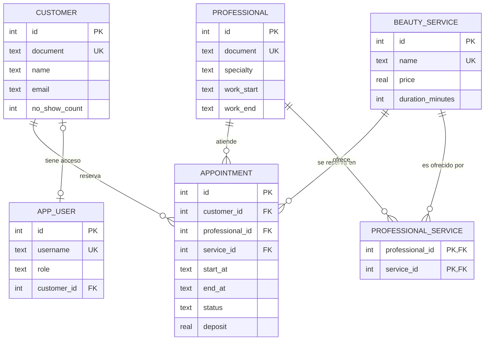
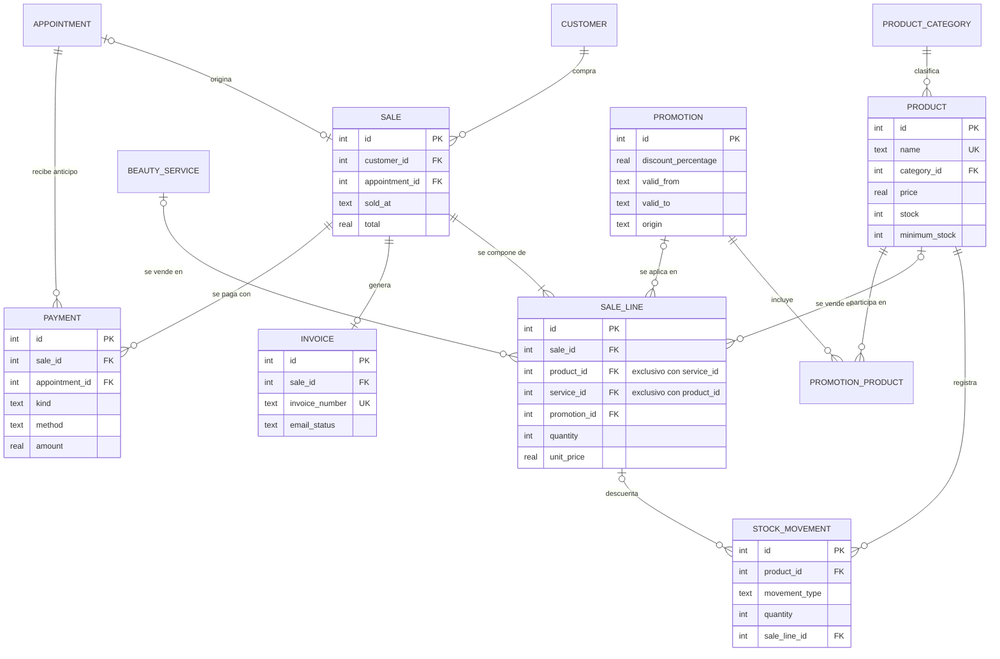
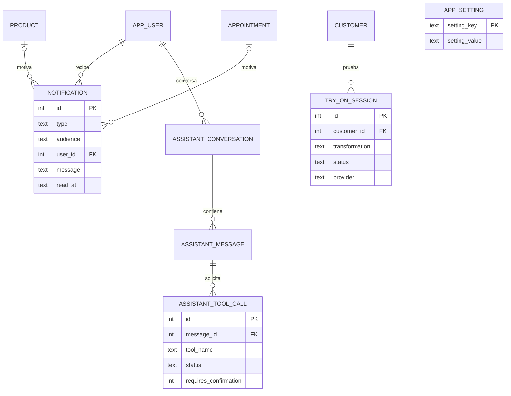

# Modelo entidad-relación — Maison Glow

> **Estado: diseño.** El esquema (`sql/schema.sql`) **no se aplica ni se conecta** en la Entrega 1, que persiste en archivos de texto
> ([ADR-0012](../adr/0012-persistencia-en-archivos-de-texto.md)). Se diseña completo desde ahora para que el modelo de clases y
> los archivos de texto nazcan coherentes con él; la conexión SQLite se hace en la Entrega 2 ([ADR-0003](../adr/0003-persistencia-sqlite-jdbc-dao.md)).
> Columnas y restricciones: [`diccionario-de-datos.md`](diccionario-de-datos.md) · decisiones: [ADR-0011](../adr/0011-decisiones-de-diseno-de-la-base-de-datos.md).

## 1. Resumen

22 tablas en 9 módulos, 4 vistas para estadísticas y alertas, y 3 triggers. Cada tabla indica en qué entrega se usa:
**D1** = lógica de negocio de la Entrega 1 (datos en archivos de texto con la misma estructura), **D2** = persistencia JDBC, **AI** = módulos de inteligencia artificial.

| Módulo | Tablas | Entrega |
|---|---|---|
| Personas y acceso | `customer`, `professional`, `app_user` | D1, D1, D2 |
| Servicios | `beauty_service`, `professional_service` | D1 |
| Inventario | `product_category`, `product`, `stock_movement` | D1, D1, D2 |
| Citas | `appointment` | D1 |
| Ventas y pagos | `sale`, `sale_line`, `payment`, `invoice` | D1, D1, D2, D2 |
| Promociones | `promotion`, `promotion_product` | D2 |
| Notificaciones y configuración | `notification`, `app_setting` | D2, D1 |
| IA: probador | `try_on_session` | AI |
| IA: asistente | `assistant_conversation`, `assistant_message`, `assistant_tool_call` | AI |

## 2. Diagramas

### 2.1 Personas, servicios y citas

### 2.2 Inventario, ventas, pagos y promociones

### 2.3 Notificaciones, configuración e inteligencia artificial

## 3. Cobertura de requerimientos funcionales

| RF | Se cubre con |
|---|---|
| 01, 02 | `customer` |
| 03, 04 | `product`, `product_category` |
| 05 | `product.stock`, `stock_movement` |
| 06, 07 | `beauty_service` (`price`, `duration_minutes`) |
| 08 | `professional` |
| 09 | `professional_service` |
| 10 | `appointment` |
| 11, 12 | `appointment` + trigger `trg_appointment_no_overlap_*` + índice `(professional_id, start_at)` |
| 13 | `appointment.status` (`CANCELLED`) y actualización de `start_at`/`end_at` |
| 14 | `sale` |
| 15 | `sale_line.product_id` |
| 16 | `sale_line.service_id` |
| 17 | `stock_movement` (tipo `SALE`) + trigger `trg_stock_movement_apply` |
| 18 | `v_customer_stats`, `app_user` (rol `CUSTOMER`) |
| 19 | `v_low_stock`, `notification` (`LOW_STOCK`) |
| 20 | `app_user` (rol `ADMIN` / `CUSTOMER`) |
| 21 | `try_on_session` |
| 22, 23 | `assistant_conversation`, `assistant_message`, `assistant_tool_call` |
| 24 | `NOT NULL`, `UNIQUE` y `CHECK` en todas las tablas (segunda barrera tras `Validator`) |
| 25 | `invoice.email_status`/`error_message`, `try_on_session.error_message`, `assistant_tool_call.status` |
| 26 | `app_setting`, `appointment.deposit`/`reminder_at`, `payment` (`DEPOSIT`), `notification` (`APPOINTMENT_REMINDER`) |
| 27 | `invoice` |
| 28 | `v_product_sales`, `v_service_demand` |
| 29 | `v_product_sales` + `app_setting.low_rotation_window_days` |
| 30 | `notification` (`LOW_ROTATION`, audiencia `ADMIN`) |
| 31 | `promotion`, `promotion_product`, `sale_line.promotion_id` |

## 4. Reglas que la base de datos hace cumplir

| Regla | Mecanismo |
|---|---|
| Un profesional no puede tener dos citas activas que se crucen | Trigger de inserción y de actualización |
| El stock nunca es negativo | `CHECK (stock >= 0)`; el movimiento que lo viole se aborta |
| Una línea de venta vende un producto **o** un servicio, nunca ambos ni ninguno | `CHECK ((product_id IS NULL) <> (service_id IS NULL))` |
| Una venta de stock siempre es negativa y referencia su línea | `CHECK` en `stock_movement` |
| Precios y duraciones son positivos; cantidades y totales no negativos | `CHECK` por columna |
| Documentos, usuarios, nombres de producto y facturas únicos | `UNIQUE` |
| Un cliente-usuario siempre enlaza un `customer`; un administrador no | `CHECK` en `app_user` |
